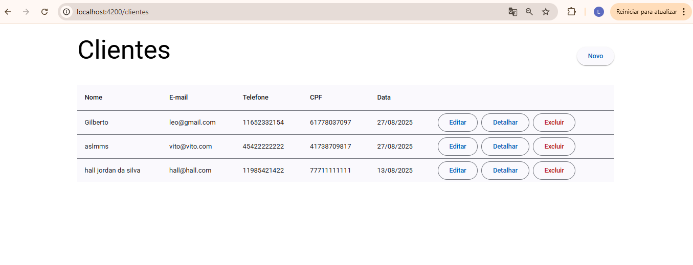
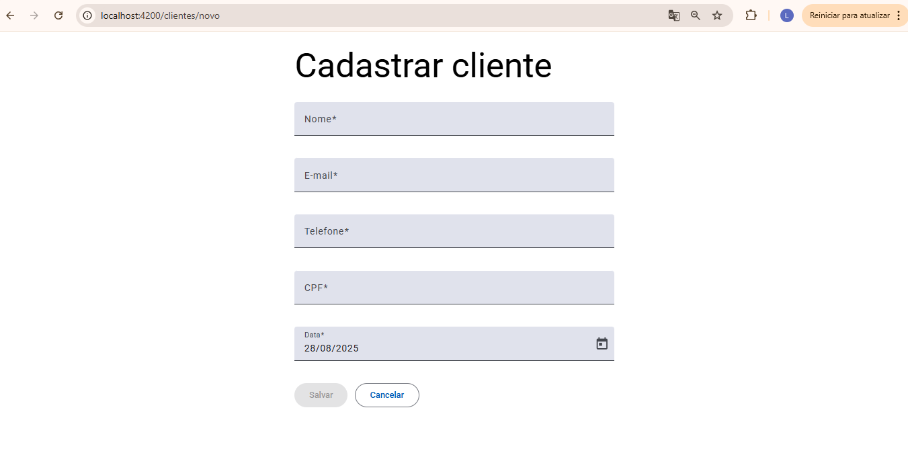
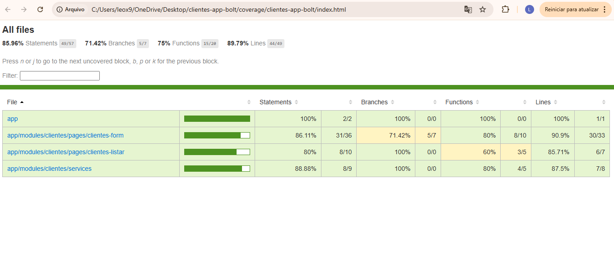

# ⚡ Cadastro de Clientes Bolt

Aplicação Angular para **gestão de clientes** com interface moderna utilizando Angular Material e Tailwind CSS.  
Inclui as funcionalidades essenciais de um CRUD completo e integração com API REST via `json-server`.

---

## 📸 Imagens do Projeto

### ✅ Interface CRUD
<!-- Adicione aqui um print da tela principal do CRUD -->



### 📊 Cobertura de Testes
<!-- Adicione aqui um print da cobertura dos testes com code-coverage -->


---

## ✅ Funcionalidades

- ✅ Listar clientes
- ✅ Cadastrar novo cliente
- ✅ Editar cliente existente
- ✅ Excluir cliente
- ✅ Validações de formulário
- ✅ Cobertura de testes superior a 80%

---

## 🚀 Tecnologias Utilizadas

- Angular 18
- Angular Material
- Tailwind CSS
- JSON Server
- Karma + Jasmine (testes unitários)

---

## 🧪 Testes

Para rodar os testes unitários com cobertura:

```bash
ng test --code-coverage
